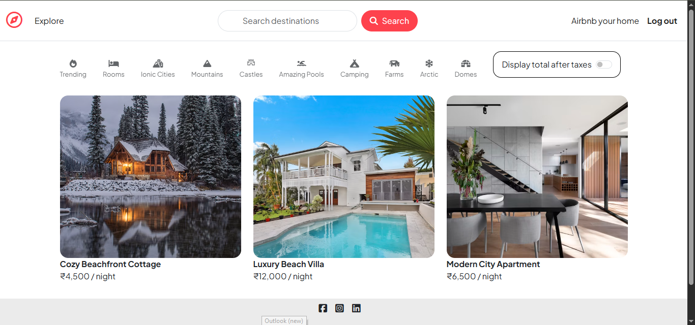
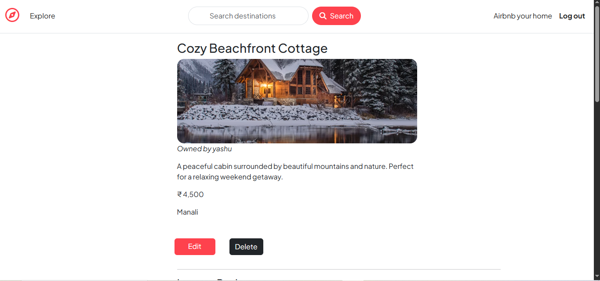
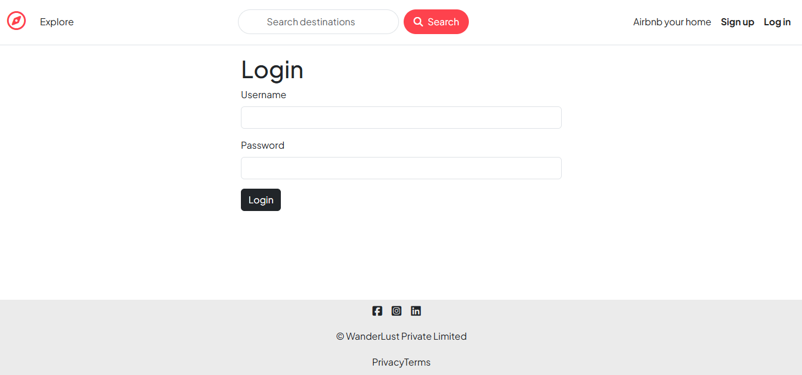
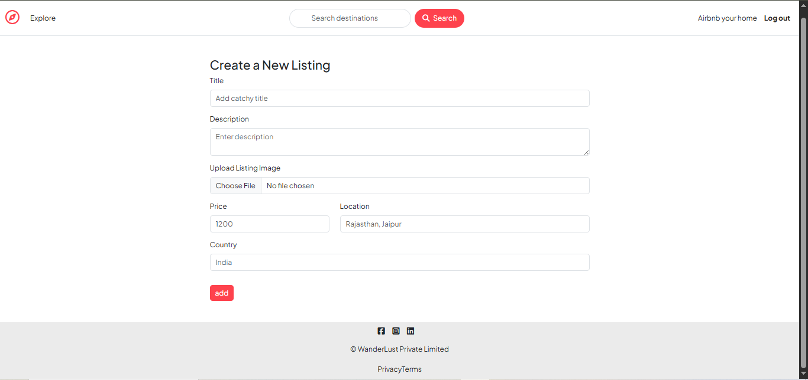
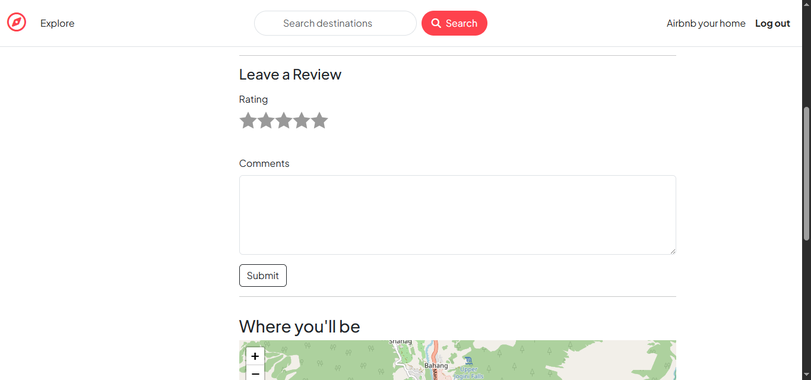
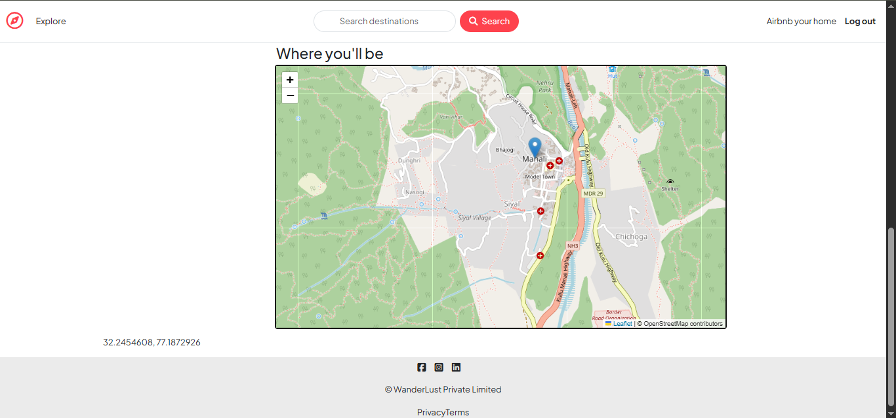

# 🏡 AirBnb — Full-Stack Property Listing Platform

<div align="center">

### A production-style Airbnb-inspired web application built with Node.js, Express.js, MongoDB & EJS

<br/>

[](https://nodejs.org/)
[](https://expressjs.com/)
[](https://www.mongodb.com/)
[](https://ejs.co/)
[](https://cloudinary.com/)
[](https://www.passportjs.org/)

<br/>

**[📂 View Repository](https://github.com/YashpalBhati68/AirBnb-Project)**

</div>

---

## 📌 Table of Contents

- [Overview](#-overview)
- [Why I Built This](#-why-i-built-this)
- [Key Features](#-key-features)
- [Application Workflow](#-application-workflow)
- [Architecture](#-architecture)
- [Tech Stack](#-tech-stack)
- [Project Structure](#-project-structure)
- [Authentication & Authorization](#-authentication--authorization)
- [Image Upload Architecture](#-image-upload-architecture)
- [Database Design](#-database-design)
- [CRUD Operations](#-crud-operations)
- [Validation & Error Handling](#-validation--error-handling)
- [Environment Variables](#-environment-variables)
- [Installation](#-installation)
- [Running Locally](#-running-locally)
- [Screenshots](#-screenshots)
- [Challenges & Solutions](#-challenges--solutions)
- [What I Learned](#-what-i-learned)
- [Future Improvements](#-future-improvements)
- [Project Highlights](#-project-highlights)
- [Author](#-author)

---

# 🚀 Overview

**AirBnb** is a full-stack web application inspired by the core functionality of Airbnb.

The application allows users to explore property listings, view individual property details, create their own listings, update or delete listings, upload property images, and interact with listings through reviews.

The backend is built using **Node.js and Express.js**, data is managed using **MongoDB with Mongoose**, and dynamic pages are rendered using **EJS**.

The project follows a structured **MVC-style architecture** with separate routes, controllers, models, middleware and utility modules.

---

# 💡 Why I Built This

I built this project to move beyond basic CRUD applications and understand how a real-world web application is structured.

The main goals were to learn and implement:

- Full-stack application architecture
- RESTful routing
- MVC architecture
- MongoDB relationships
- Authentication
- Authorization
- Session management
- Image upload and cloud storage
- Server-side validation
- Middleware
- Error handling
- Dynamic server-side rendering

Instead of keeping everything inside a single server file, the application separates responsibilities into different modules.

---

# ✨ Key Features

## 👤 User Authentication

- User registration
- User login
- User logout
- Passport.js Local Strategy
- Session-based authentication
- Persistent sessions using MongoDB
- Protected routes

---

## 🏠 Listing Management

Users can:

- View all available listings
- View details of a particular listing
- Create a new listing
- Edit an existing listing
- Delete a listing
- Upload listing images
- Associate listings with their owners

---

## ⭐ Review System

Users can interact with listings through reviews.

Features include:

- Add a review
- Add rating
- Display reviews
- Delete reviews
- Associate reviews with users
- Associate reviews with listings

---

## ☁️ Cloud Image Upload

Property images are uploaded using **Multer** and stored on **Cloudinary**.

Instead of storing image files directly inside MongoDB, the application stores the cloud image information/reference.

This makes the application more scalable and keeps the database focused on structured data.

---

## 🛡️ Authorization

Authentication answers:

> **"Who is the user?"**

Authorization answers:

> **"What is this user allowed to do?"**

Protected routes ensure that users cannot perform restricted operations without proper authorization.

For example:

```text
User
  ↓
Request
  ↓
Authentication Check
  ↓
Authorization Check
  ↓
Controller
  ↓
Database Operation
```

---

## ⚠️ Validation

The project uses **Joi** for validating incoming data before processing it.

This helps prevent invalid listing/review data from reaching the database.

---

## 💬 Flash Messages

The application uses flash messages to provide feedback after actions such as:

- Login
- Logout
- Creating a listing
- Updating a listing
- Deleting a listing
- Validation failures

---

# 🔄 Application Workflow

The overall request-response cycle looks like this:

```text
                    USER
                     │
                     ▼
              ┌──────────────┐
              │  Browser/UI  │
              └──────┬───────┘
                     │
                     ▼
              ┌──────────────┐
              │ Express.js   │
              │   Routes     │
              └──────┬───────┘
                     │
                     ▼
              ┌──────────────┐
              │ Middleware   │
              │ Auth/Valid.  │
              └──────┬───────┘
                     │
                     ▼
              ┌──────────────┐
              │ Controllers  │
              └──────┬───────┘
                     │
                     ▼
              ┌──────────────┐
              │   Mongoose   │
              │    Models    │
              └──────┬───────┘
                     │
                     ▼
              ┌──────────────┐
              │   MongoDB    │
              └──────────────┘
```

For image uploads:

```text
Browser
   │
   ▼
Multer
   │
   ▼
Cloudinary
   │
   ▼
Image URL / Metadata
   │
   ▼
MongoDB
```

---

# 🏗️ Architecture

The project follows an **MVC-inspired architecture**.

```text
                    ┌─────────────────────┐
                    │       Client        │
                    │    Browser / UI     │
                    └──────────┬──────────┘
                               │
                               ▼
                    ┌─────────────────────┐
                    │       Routes        │
                    │ Listing / Review /  │
                    │       User          │
                    └──────────┬──────────┘
                               │
                               ▼
                    ┌─────────────────────┐
                    │     Middleware      │
                    │ Auth / Validation / │
                    │      Errors         │
                    └──────────┬──────────┘
                               │
                               ▼
                    ┌─────────────────────┐
                    │    Controllers      │
                    │ Application Logic   │
                    └──────────┬──────────┘
                               │
                               ▼
                    ┌─────────────────────┐
                    │       Models        │
                    │      Mongoose       │
                    └──────────┬──────────┘
                               │
                               ▼
                    ┌─────────────────────┐
                    │      MongoDB        │
                    └─────────────────────┘
```

This separation makes the application easier to understand, maintain and extend.

---

# 🛠️ Tech Stack

| Layer                   | Technology            |
| ----------------------- | --------------------- |
| Runtime                 | Node.js               |
| Backend                 | Express.js            |
| Database                | MongoDB Atlas         |
| ODM                     | Mongoose              |
| Frontend                | HTML, CSS, JavaScript |
| Template Engine         | EJS                   |
| Layout Engine           | EJS-Mate              |
| Authentication          | Passport.js           |
| Authentication Strategy | Passport Local        |
| Sessions                | Express Session       |
| Session Store           | Connect Mongo         |
| Image Upload            | Multer                |
| Image Storage           | Cloudinary            |
| Validation              | Joi                   |
| Flash Messages          | Connect Flash         |
| HTTP Method Support     | Method Override       |
| Maps / Location         | Mapbox SDK            |
| Environment Config      | Dotenv                |
| HTTP Client             | Axios                 |

The current repository's `package.json` includes these core dependencies and specifies Node.js `24.3.0`.

---

# 📁 Project Structure

```text
AirBnb-Project/
│
├── controllers/
│   └── Application business logic
│
├── models/
│   ├── listing.js
│   ├── review.js
│   └── user.js
│
├── routes/
│   ├── listing.js
│   ├── review.js
│   └── user.js
│
├── views/
│   ├── layouts/
│   ├── listings/
│   ├── users/
│   ├── includes/
│   └── error.ejs
│
├── public/
│   ├── css/
│   └── js/
│
├── utilis/
│   ├── ExpressError.js
│   └── wrapAsync.js
│
├── init/
│   └── Database initialization / seed files
│
├── app.js
├── cloudConfig.js
├── middleware.js
├── schema.js
├── package.json
├── package-lock.json
└── .gitignore
```

The repository currently contains separate folders for controllers, models, routes, views, public assets and utilities, along with the main application/configuration files.

---

# 🔐 Authentication & Authorization

Authentication is implemented using **Passport.js with Passport Local Strategy**.

### Registration Flow

```text
User
 │
 ▼
Signup Form
 │
 ▼
POST Request
 │
 ▼
User Model
 │
 ▼
Passport Local Mongoose
 │
 ▼
MongoDB
 │
 ▼
Account Created
```

### Login Flow

```text
User
 │
 ▼
Login Form
 │
 ▼
Passport Authentication
 │
 ▼
Credentials Verification
 │
 ▼
Session Created
 │
 ▼
Authenticated User
```

### Authorization Flow

```text
Request
   │
   ▼
Is User Logged In?
   │
 ┌─┴───────────┐
 │             │
YES            NO
 │             │
 ▼             ▼
Continue      Redirect
 │             │
 ▼             ▼
Authorization  Login
Check
 │
 ▼
Controller
```

This distinction between authentication and authorization is an important part of the application's security design.

---

# 🖼️ Image Upload Architecture

The project uses **Multer + Cloudinary** for image handling.

```text
             User
              │
              ▼
        Upload Image
              │
              ▼
           Multer
              │
              ▼
         Cloudinary
              │
              ▼
      Cloud Image URL
              │
              ▼
           MongoDB
```

### Why Cloudinary?

Storing large binary image files directly in the application database is not ideal.

Instead:

```text
Image File
    ↓
Cloudinary
    ↓
URL / Metadata
    ↓
MongoDB
```

The database stores the reference while Cloudinary handles the actual image storage.

---

# 🗄️ Database Design

The application uses MongoDB with Mongoose.

The main entities are:

```text
User
 │
 ├─────────────── owns ───────────────► Listings
 │
 └─────────────── writes ─────────────► Reviews

Listing
 │
 └────────────── contains ────────────► Reviews
```

### User

Responsible for storing user/account information and authentication-related data.

### Listing

Represents a property available on the platform.

Typical information includes:

```text
Listing
├── title
├── description
├── price
├── location
├── country
├── image
├── owner
└── reviews
```

### Review

Represents feedback associated with a listing.

```text
Review
├── comment
├── rating
├── author
└── listing
```

Mongoose is responsible for defining schemas and relationships between these entities.

---

# 🔄 CRUD Operations

The application implements the core CRUD lifecycle.

### Create

```text
User
 ↓
Create Listing
 ↓
POST Request
 ↓
Validation
 ↓
Database
```

### Read

```text
GET Request
 ↓
Controller
 ↓
MongoDB
 ↓
EJS Template
 ↓
Browser
```

### Update

```text
Edit Listing
 ↓
PUT Request
 ↓
Authorization
 ↓
Validation
 ↓
MongoDB Update
```

### Delete

```text
Delete Request
 ↓
Authorization
 ↓
Controller
 ↓
MongoDB
 ↓
Listing Removed
```

---

# 🧩 Validation & Error Handling

The application uses centralized utilities and middleware to make error handling more consistent.

### Validation

```text
Incoming Data
      ↓
     Joi
      ↓
 ┌────┴─────┐
 │          │
Valid     Invalid
 │          │
 ▼          ▼
Process    Error
```

### Async Error Handling

Asynchronous Express operations are wrapped to avoid repeatedly writing the same `try/catch` structure.

Conceptually:

```javascript
wrapAsync(async (req, res) => {
  // async controller logic
});
```

This keeps route/controller code cleaner.

---

# 🔑 Environment Variables

Create a `.env` file in the project root.

```env
ATLASDB_URL=your_mongodb_connection_string

SECRET=your_session_secret

CLOUD_NAME=your_cloudinary_cloud_name
CLOUD_API_KEY=your_cloudinary_api_key
CLOUD_API_SECRET=your_cloudinary_api_secret

MAP_TOKEN=your_mapbox_token
```

> **Important:** Never commit `.env` files, database credentials, API keys or secrets to GitHub.

---

# ⚙️ Installation

## 1. Clone the Repository

```bash
git clone https://github.com/YashpalBhati68/AirBnb-Project.git
```

## 2. Navigate to the Project

```bash
cd AirBnb-Project
```

## 3. Install Dependencies

```bash
npm install
```

## 4. Configure Environment Variables

Create:

```text
.env
```

and add your MongoDB, Cloudinary, Mapbox and session configuration.

## 5. Start the Application

```bash
node app.js
```

For development:

```bash
nodemon app.js
```

## 6. Open the Application

```text
http://localhost:8080
```

---

# 📸 Screenshots

### 🏠 Home / Listings



### 🏡 Listing Details



### 🔐 Login



### 📝 Create Listing



### ⭐ Reviews



### 📍 Location / Map




# 🎯 Challenges & Solutions

Building this project helped me solve several practical backend and full-stack development problems.

### 1. Managing Authentication

**Challenge:**
Restricting certain routes to authenticated users.

**Solution:**
Implemented Passport.js authentication with session management and authentication middleware.

---

### 2. Protecting User-Owned Resources

**Challenge:**
A logged-in user should not automatically be allowed to modify every listing.

**Solution:**
Added authorization checks before sensitive operations.

---

### 3. Image Storage

**Challenge:**
Storing property images directly inside the database is inefficient.

**Solution:**
Used Multer for file handling and Cloudinary for cloud image storage.

---

### 4. Data Validation

**Challenge:**
Users can submit incomplete or invalid form data.

**Solution:**
Used Joi for server-side validation.

---

### 5. MongoDB Sessions

**Challenge:**
In-memory sessions are not suitable for scalable deployments.

**Solution:**
Used `connect-mongo` to persist Express sessions in MongoDB.

---

### 6. Maintainable Backend Structure

**Challenge:**
Keeping routes, database operations and business logic inside one file makes applications difficult to maintain.

**Solution:**
Separated responsibilities into:

```text
Routes
   ↓
Middleware
   ↓
Controllers
   ↓
Models
   ↓
Database
```

---

# 🧠 What I Learned

Through this project, I gained practical experience with:

### Backend Development

- Node.js
- Express.js
- RESTful routing
- Middleware
- Controllers
- Error handling
- Async operations

### Database

- MongoDB
- MongoDB Atlas
- Mongoose
- Schema design
- Relationships
- CRUD operations

### Authentication

- Passport.js
- Local authentication
- Sessions
- Authentication middleware
- Authorization

### File Management

- Multer
- Cloudinary
- Cloud image storage

### Frontend

- HTML
- CSS
- JavaScript
- EJS
- EJS-Mate
- Dynamic server-side rendering

### Development Practices

- MVC architecture
- Environment variables
- Git & GitHub
- Modular code organization
- Server-side validation

---

# 🚀 Future Improvements

The current application can be extended with several production-level features.

### 🔎 Advanced Search

- Search by location
- Price range
- Property type
- Availability
- Rating

### 📅 Booking System

Add:

- Check-in date
- Check-out date
- Availability management
- Booking history
- Booking cancellation

### 💳 Payment Integration

Integrate a payment gateway such as:

- Razorpay
- Stripe

### ❤️ Wishlist

Allow users to save their favorite properties.

### 🔔 Notifications

Add:

- Booking notifications
- Review notifications
- Listing updates
- Email notifications

### 👤 Enhanced User Profiles

Add:

- Profile picture
- User bio
- Account settings
- User's listings
- User's reviews

### 🧪 Testing

Add automated testing using tools such as:

- Jest
- Supertest

### 🔐 Additional Security

Future security improvements could include:

- Rate limiting
- Helmet
- CSRF protection
- Input sanitization
- Stronger cookie configuration

---

# 📊 Project Highlights

| Area               | Implementation                  |
| ------------------ | ------------------------------- |
| Architecture       | MVC-inspired                    |
| Backend            | Node.js + Express               |
| Database           | MongoDB Atlas                   |
| ODM                | Mongoose                        |
| Authentication     | Passport.js                     |
| Sessions           | Express Session + Connect Mongo |
| Validation         | Joi                             |
| Images             | Multer + Cloudinary             |
| Templates          | EJS + EJS-Mate                  |
| Reviews            | Rating + Comments               |
| CRUD               | Listings                        |
| Error Handling     | Custom middleware               |
| Environment Config | Dotenv                          |
| Maps               | Mapbox SDK                      |

---

# 💻 Development Philosophy

The main focus of this project was not just to make the application work, but to understand **how different backend components communicate with each other**.

The core architecture can be summarized as:

```text
        CLIENT
          │
          ▼
       EXPRESS
          │
     ┌────┴────┐
     │         │
 ROUTES    MIDDLEWARE
     │         │
     └────┬────┘
          │
          ▼
     CONTROLLERS
          │
          ▼
       MODELS
          │
          ▼
      MONGODB
```

External services:

```text
             ┌──────────────┐
             │  Cloudinary  │
             │    Images    │
             └──────▲───────┘
                    │
                    │
MongoDB ◄──── Express Application ────► Mapbox
```

---

# 🌟 Project Goals

The project demonstrates practical understanding of:

```text
Frontend
   +
Backend
   +
Database
   +
Authentication
   +
Authorization
   +
Cloud Services
   +
Validation
   +
Error Handling
   =
Full-Stack Application
```

---

# 👨‍💻 Author

## Yashpal Bhati

**Full Stack Developer | Computer Science & Engineering Student**

I enjoy building full-stack applications, solving programming problems and learning how scalable software systems work.

### Connect With Me

- 💻 GitHub: [YashpalBhati68](https://github.com/YashpalBhati68)
- 🔗 LinkedIn: https://www.linkedin.com/in/yashpal-bhati-028064294?utm_source=share_via&utm_content=profile&utm_medium=member_android

---

# ⭐ Support

If you found this project useful or interesting:

- ⭐ Star the repository
- 🍴 Fork the project
- 🐛 Open an issue
- 💡 Suggest improvements

Your feedback is always welcome!

---

# 📄 Disclaimer

This project is an **educational Airbnb-inspired application** created for learning and portfolio purposes.

---

<div align="center">

### 🏡 Built with Node.js • Express.js • MongoDB • EJS • Cloudinary

**Made with ❤️ by Yashpal Bhati**

⭐ If you like this project, consider giving it a star!

<<<<<<< HEAD

# </div>

</div>
>>>>>>> 5aefdc4 (Add premium README and project screenshots)
